# Entorno de Desarrollo - Software de Gestión Empresarial

Este repositorio contiene la configuración base del entorno de desarrollo usando **Docker**. 
Con solo unos comandos se tendrá un servidor web (PHP 8.2), una base de datos (MariaDB) y phpMyAdmin funcionando en la máquina local, sin necesidad de instalar XAMPP ni WAMP.

---

## Requisitos previos

1. **Docker Desktop** (con el backend de WSL2 activado si usa Windows).  
   [Descargar Docker Desktop](https://www.docker.com/products/docker-desktop/)
2. **Git** (para clonar el repositorio).
3. **Visual Studio Code** (recomendado) con la extensión "Remote - Containers" o "Dev Containers" (opcional).

---

## Paso a paso para levantar el entorno

### 1. Clonar el repositorio
Abrir la terminal (WSL2 / PowerShell / Bash) y ejecuta:
```bash
git clone https://github.com/jamescanos/SoftwareGestionEmpresarial.git
cd entorno-sge
```

### 2. Estructura Inicial
Dentro de la carpeta, crea una carpeta llamada src
```bash
mkdir src
```

### 3. Levantar los contenedores
Ejecutar el siguiente comando en la raíz del proyecto (donde está el docker-compose.yml):
```bash
docker-compose up -d
```

El flag -d significa "detached" (corre en segundo plano). Si se desean ver los logs en vivo, se quita el -d.

### 4. Verificar que todo funciona
PHP/Apache: Abrir el navegador y acceder a http://localhost:8080. 
```
Se debe ver página de información de PHP (phpinfo()).
```

phpMyAdmin: Acceder a http://localhost:8081. 
```
Usuario: root, Contraseña: root_password.
```

Base de datos: conectarse desde phpMyAdmin o desde su código PHP usando:

```
   Host: db (el nombre del servicio en el compose)
   Usuario: root (o dev_user)
   Contraseña: root_password (o dev_password)
   Base de datos: seminario_db
```
---

# Clase 2 - Framework Laravel

Durante la Clase 2 se realizó la instalación y configuración inicial de **Laravel** como framework para el desarrollo del sistema ERP.

El proyecto propuesto corresponde a un **ERP para la Administración de Propiedad Horizontal**, orientado a organizaciones que administran una o varias copropiedades.

Inicialmente, el ERP contempla tres módulos principales:

- Gestión de PQRS.
- Gestión de mantenimiento.
- Gestión documental.

La estructura se plantea de forma modular para permitir la incorporación de nuevos módulos en futuras etapas del proyecto.

## Instalación de Laravel

### Requisitos

Para el desarrollo se utilizaron las siguientes herramientas:

- PHP 8.5
- Composer 2
- Laravel 13
- Git
- Visual Studio Code

### Crear el proyecto Laravel

El proyecto fue creado mediante Composer:

```bash
composer create-project laravel/laravel sge
```

Ingresar al proyecto:

```bash
cd sge
```

### Verificar la estructura

Para comprobar la estructura generada por Laravel:

```bash
ls -la
```

Entre los principales directorios creados se encuentran:

```text
app/
bootstrap/
config/
database/
public/
resources/
routes/
storage/
```

### Ejecutar Laravel

El servidor de desarrollo de Laravel se inicia mediante Artisan:

```bash
php artisan serve
```

Por defecto, la aplicación queda disponible en:

```text
http://127.0.0.1:8000
```

Para detener el servidor:

```text
Ctrl + C
```

## Análisis del ERP

El análisis inicial del proyecto se encuentra en:

```text
Clase2/ANALISIS_EMPRESA.md
```

La estructura general propuesta es:

```text
Organización
    │
    └── Copropiedad
            │
            ├── Gestión de PQRS
            ├── Gestión de Mantenimiento
            └── Gestión Documental
```

## Modelo Entidad-Relación

El primer Modelo Entidad-Relación (MER) del ERP se encuentra en:

```text
Clase2/evidencias/MER_ERP.png
```

## Evidencias

Las evidencias correspondientes a la Clase 2 se encuentran en:

## Evidencias Clase 2

### Validación de PHP y Composer

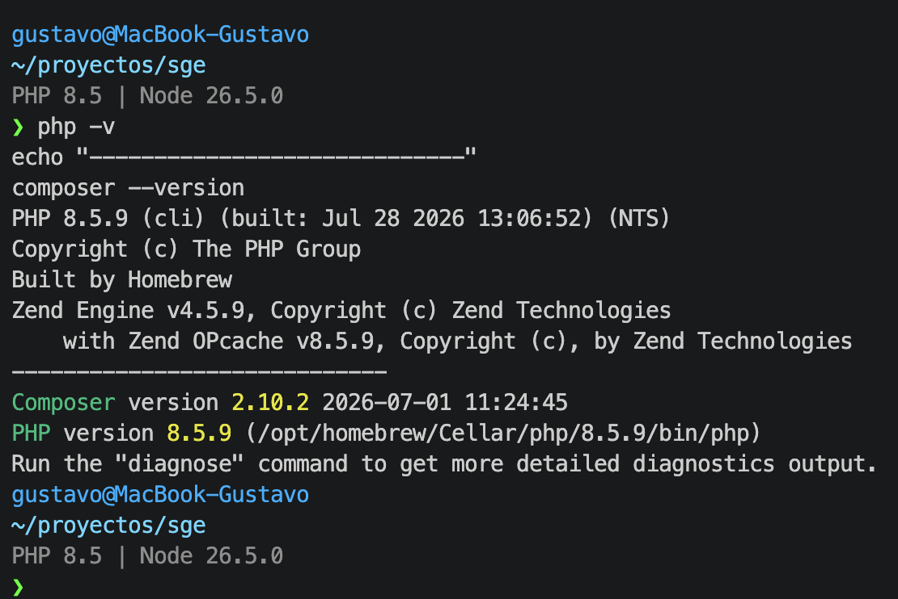

### Estructura del proyecto Laravel

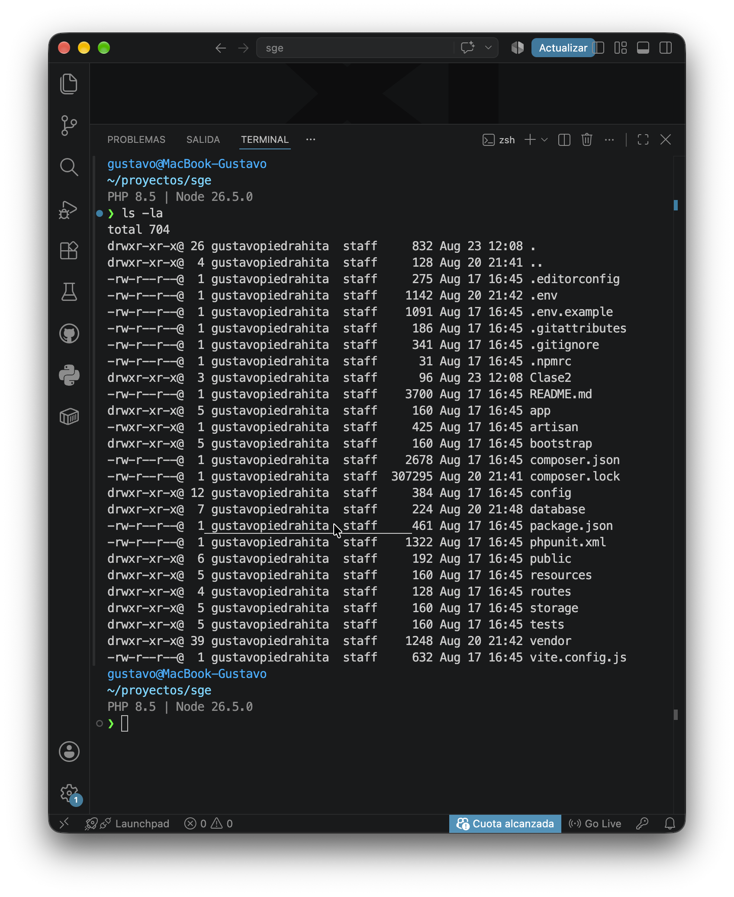

### Laravel funcionando

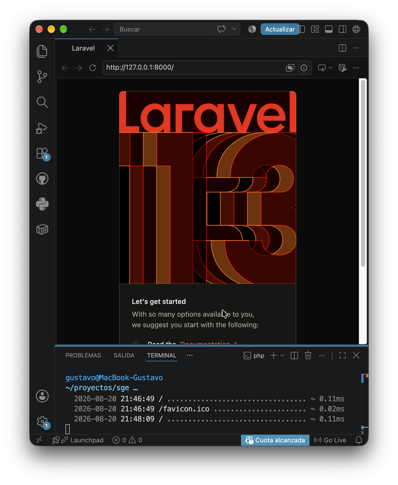

### Modelo Entidad-Relación del ERP

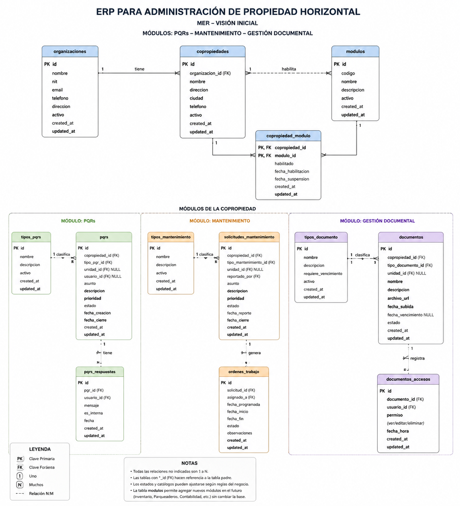

Incluyen:

- Validación de PHP y Composer.
- Estructura del proyecto Laravel.
- Página inicial de Laravel funcionando.
- Primer Modelo Entidad-Relación del ERP.

# Clase 3 - Laravel Sail, MVC y Artisan

En esta clase se profundizó en la estructura de Laravel, el patrón MVC, el uso de Artisan y la ejecución del proyecto mediante Laravel Sail y Docker.

## Estructura principal de Laravel

Laravel organiza el proyecto en diferentes directorios, cada uno con una responsabilidad específica:

- `app/`: contiene la lógica principal de la aplicación, incluyendo modelos y controladores.
- `bootstrap/`: contiene los archivos necesarios para iniciar Laravel.
- `config/`: almacena los archivos de configuración.
- `database/`: contiene migraciones, seeders y factories.
- `public/`: punto de entrada público de la aplicación mediante `index.php`.
- `resources/`: contiene vistas Blade y recursos del frontend.
- `routes/`: contiene la definición de las rutas de la aplicación.
- `storage/`: almacena logs, caché y archivos generados.
- `vendor/`: contiene las dependencias instaladas mediante Composer.
- `.env`: contiene las variables de configuración del entorno local.

## Patrón MVC

Laravel utiliza el patrón Modelo - Vista - Controlador (MVC):

- **Modelo:** representa y gestiona los datos de la aplicación.
- **Vista:** presenta la información al usuario.
- **Controlador:** recibe las solicitudes y coordina la comunicación entre modelos y vistas.

## Flujo de una petición

El flujo básico de una petición en Laravel es:

```text
Usuario
   │
   ▼
public/index.php
   │
   ▼
routes/web.php
   │
   ▼
Controlador
   │
   ▼
Modelo / Base de datos
   │
   ▼
Controlador
   │
   ▼
Vista Blade
   │
   ▼
Respuesta HTML
   │
   ▼
Usuario
```

## Artisan

Artisan es la interfaz de línea de comandos de Laravel. Permite realizar tareas como crear controladores, ejecutar migraciones y administrar diferentes componentes del framework.

Durante la práctica se utilizaron, entre otros:

```bash
php artisan list
php artisan help make:controller
php artisan make:controller PruebaController
```

## Laravel Sail

Laravel Sail proporciona un entorno de desarrollo basado en Docker.

Para este proyecto se configuraron los servicios de Laravel y MySQL. Debido a que otros proyectos locales utilizan algunos de los puertos predeterminados, se configuraron puertos alternativos para evitar conflictos.

El entorno se inicia mediante:

```bash
./vendor/bin/sail up -d
```

Y puede detenerse mediante:

```bash
./vendor/bin/sail down
```

## Variables de entorno

El archivo `.env` permite configurar el comportamiento de la aplicación según el entorno sin modificar directamente el código fuente.

Para la conexión de Laravel con MySQL mediante Sail se utilizan variables como:

```text
DB_CONNECTION=mysql
DB_HOST=mysql
DB_PORT=3306
DB_DATABASE=laravel
DB_USERNAME=sail
DB_PASSWORD=password
```

También se configuraron puertos alternativos para el entorno local:

```text
APP_PORT=8082
FORWARD_DB_PORT=3307
VITE_PORT=5174
```

El archivo `.env` contiene configuración local y no debe almacenarse en el repositorio Git.

## Migraciones

Las migraciones fueron ejecutadas dentro del entorno de Sail mediante:

```bash
./vendor/bin/sail php artisan migrate
```

Se verificó posteriormente la creación de las tablas en la base de datos `laravel`.

## Evidencias Clase 3

### PHP y Composer

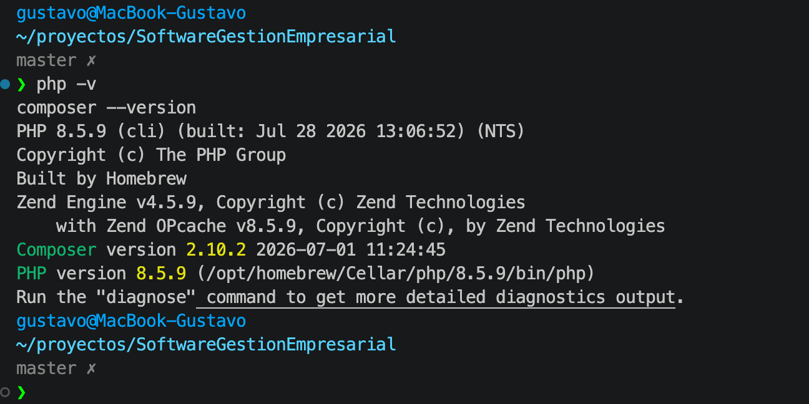

### Estructura del proyecto

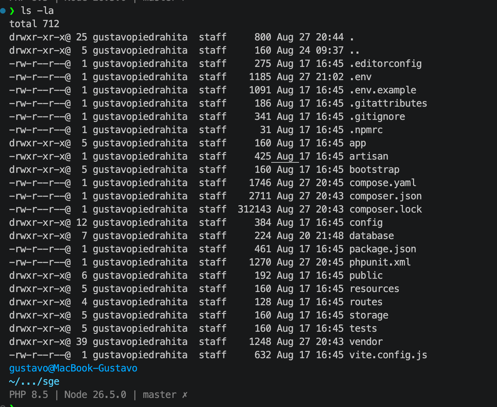

### Artisan

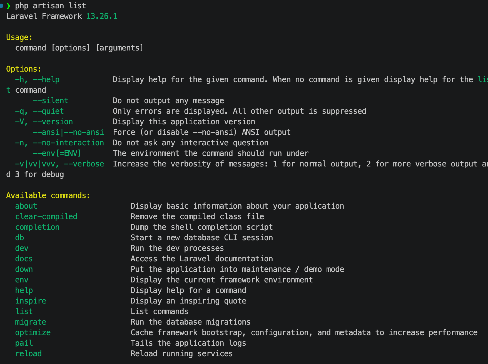

### Laravel Sail y Docker

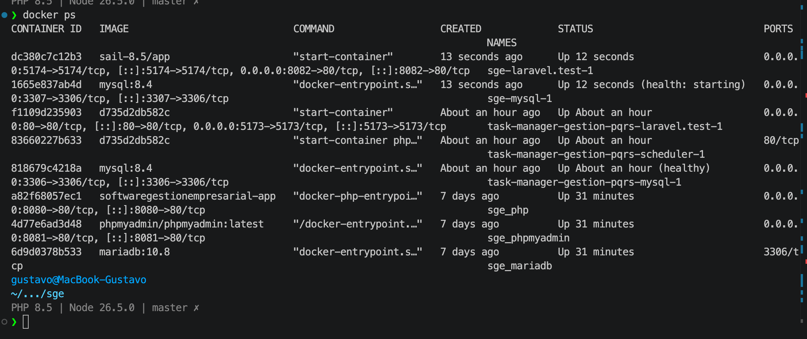

### Configuración del entorno

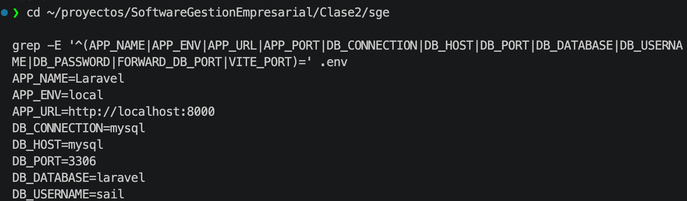

### Laravel modificado

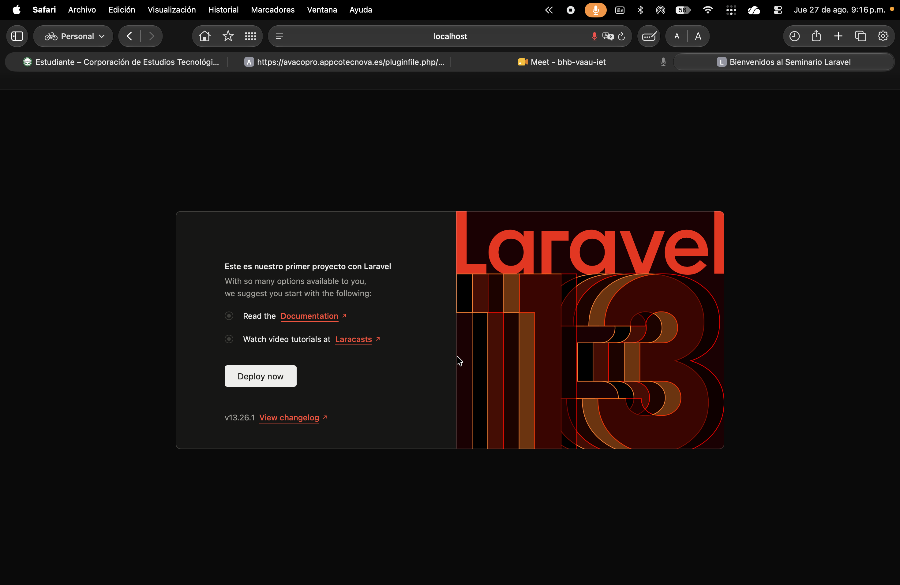


## Proyecto académico: Resuelve ERP

El proyecto de trabajo se encuentra en `resuelve-erp/`, incorporado como archivos
del repositorio académico a partir de Resuelve, commit `5e6996f`. Incluye la
adaptación de datos de demostración para Gestión Urbana de Copropiedades S.A.S.
y el Conjunto Residencial Altos del Parque.

Consultar `resuelve-erp/README.md` para la aplicación y
`resuelve-erp/docs/integracion-academica.md` para las notas del entorno académico.

# Clase 4 - Autenticación, navegación e interfaz de Resuelve ERP

Durante la Clase 4 se trabajó sobre el proyecto académico **Resuelve ERP**, ubicado en la carpeta `resuelve-erp/`, adaptando los requerimientos de la guía al nivel de desarrollo actual de la aplicación.

## Autenticación y control de acceso

Resuelve ERP ya contaba con un sistema de autenticación propio, por lo que se conservó su arquitectura existente en lugar de incorporar Laravel Breeze.

La aplicación dispone de:

- Inicio y cierre de sesión.
- Recuperación de contraseña.
- Protección de rutas para usuarios autenticados.
- Roles y permisos.
- Administración controlada de usuarios.
- Contexto de organización y copropiedad.
- Redirección al panel de Inicio después de la autenticación.

El registro público no se habilita, debido a que los usuarios deben estar asociados de forma controlada a una organización, copropiedad y rol.

## Navegación e interfaz

Se revisó y adaptó la interfaz autenticada de Resuelve ERP para cumplir los objetivos visuales y funcionales de la clase.

Entre los elementos trabajados se encuentran:

- Barra superior de navegación.
- Acceso a Inicio, PQRS, Personas, Documentos y Administración.
- Visualización de la copropiedad activa.
- Panel principal con indicadores y visualizaciones.
- Formulario funcional de radicación de PQRS.
- Listado operativo de PQRS.
- Área administrativa.
- Ajustes generales de legibilidad.
- Diseño adaptable.
- Modo claro y oscuro.
- Pie de página con nombre del sistema, organización, año y versión.

Como parte de la adaptación, el panel de Inicio se estableció como destino predeterminado para los usuarios después de iniciar sesión.

## Adaptación de la guía

Debido a que Resuelve ERP parte de una aplicación previamente desarrollada, algunos requerimientos de la guía se implementaron mediante funcionalidades equivalentes ya existentes.

No se incorporó Laravel Breeze ni se habilitó registro público de usuarios. Tampoco se creó una página pública adicional de inicio, ya que la aplicación está orientada a un entorno administrativo autenticado.

El formulario de radicación de PQRS se utilizó como evidencia de formulario funcional dentro del dominio real del ERP.

## Evidencias Clase 4

Las evidencias visuales se encuentran en:

```text
resuelve-erp/docs/evidencias/
```

Incluyen:

- Inicio de sesión.
- Panel de Inicio.
- Navegación principal.
- Radicación de PQRS.
- Listado de PQRS.
- Administración.

La documentación detallada de la implementación, requisitos, instalación y decisiones de adaptación se encuentra en:

```text
resuelve-erp/README.md
```

# Clase 5 - Migraciones, modelos y seeders en Resuelve ERP

Durante la Clase 5 se trabajó sobre el proyecto académico **Resuelve ERP**, ubicado en la carpeta `resuelve-erp/`, adaptando la guía de migraciones y modelos al dominio real de la aplicación.

## Entidades seleccionadas

Para el desarrollo de la actividad se utilizaron tres entidades existentes en Resuelve ERP:

- **Organización:** representa la entidad encargada de administrar una o varias copropiedades.
- **Copropiedad:** representa los conjuntos residenciales administrados dentro de una organización.
- **Persona:** representa las personas naturales o jurídicas registradas dentro del contexto de una organización.

Las tablas correspondientes son:

```text
organizaciones
copropiedades
personas
```

Debido a que Resuelve ERP ya contaba con las migraciones y modelos Eloquent de estas entidades, se conservaron las implementaciones existentes y se verificó su funcionamiento en lugar de crear estructuras duplicadas.

## Relaciones entre entidades

Las entidades implementan relaciones uno a muchos (1:N).

Una organización puede tener múltiples copropiedades:

```text
Organizacion (1) ─────< Copropiedad (N)
```

Una organización también puede tener múltiples personas:

```text
Organizacion (1) ─────< Persona (N)
```

Estas relaciones se implementan mediante la llave foránea `organizacion_id` y las relaciones Eloquent `hasMany()` y `belongsTo()` existentes en los modelos.

## Seeders y datos de prueba

Se crearon los siguientes seeders:

```text
database/seeders/OrganizacionSeeder.php
database/seeders/CopropiedadSeeder.php
database/seeders/PersonaSeeder.php
```

Los seeders generan datos sintéticos pero realistas para simular el funcionamiento del sistema sin utilizar información personal real.

También fueron integrados en `DatabaseSeeder.php` para permitir su ejecución mediante:

```bash
./vendor/bin/sail php artisan db:seed
```

Después de ejecutar los seeders se verificaron los siguientes registros:

```text
organizaciones  → 6 registros
copropiedades   → 6 registros
personas        → 5 registros
```

Los seeders utilizan mecanismos como `updateOrCreate()` y `firstOrNew()` para evitar la creación repetitiva de los mismos registros al ejecutar nuevamente el proceso de seeding.

## Verificación con Laravel Tinker

Se utilizó Laravel Tinker para comprobar la interacción directa con los modelos Eloquent:

```bash
./vendor/bin/sail php artisan tinker
```

Desde Tinker se insertó una organización de demostración mediante el modelo `Organizacion` y se verificó el registro generado. Posteriormente, el registro temporal fue eliminado para mantener limpia la base de datos.

## Verificación en MySQL

Se verificó la existencia de las tablas mediante:

```sql
SHOW TABLES;
```

También se comprobó la relación entre copropiedades y organizaciones mediante una consulta con `JOIN`, verificando que las copropiedades generadas estuvieran asociadas correctamente con su organización.

## Evidencias Clase 5

### Tablas creadas en MySQL

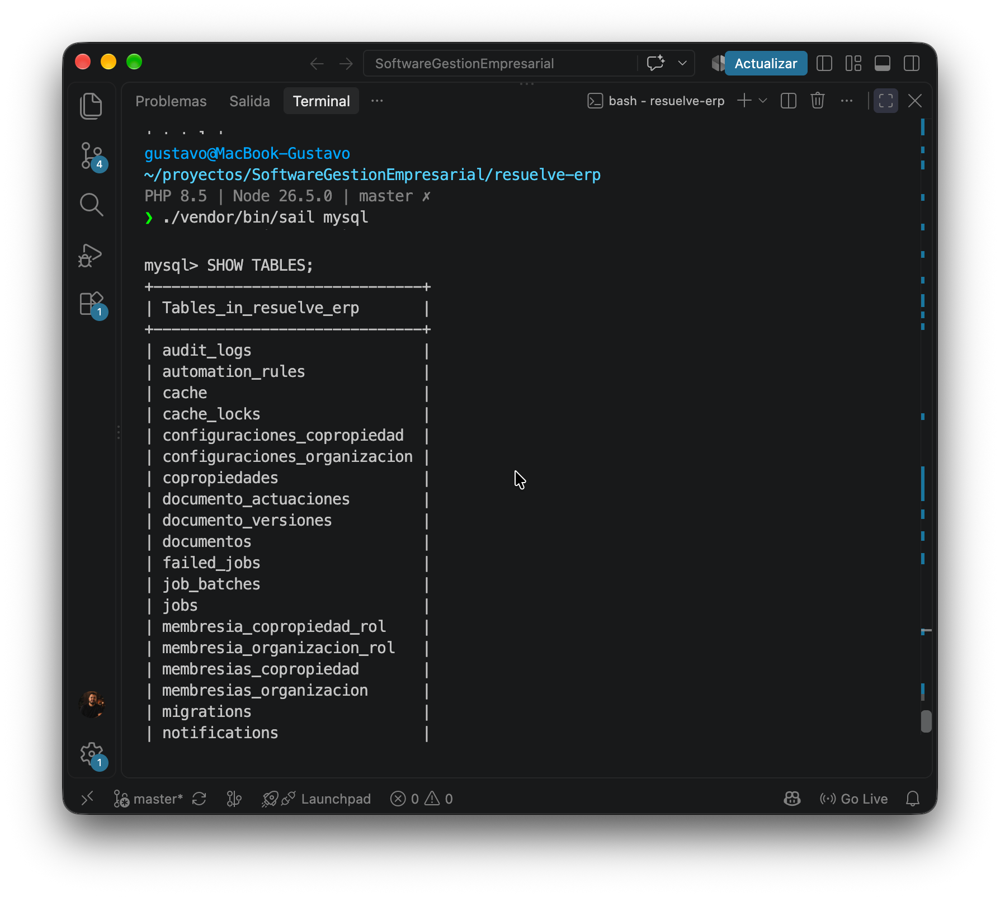

### Inserción de registro mediante Tinker

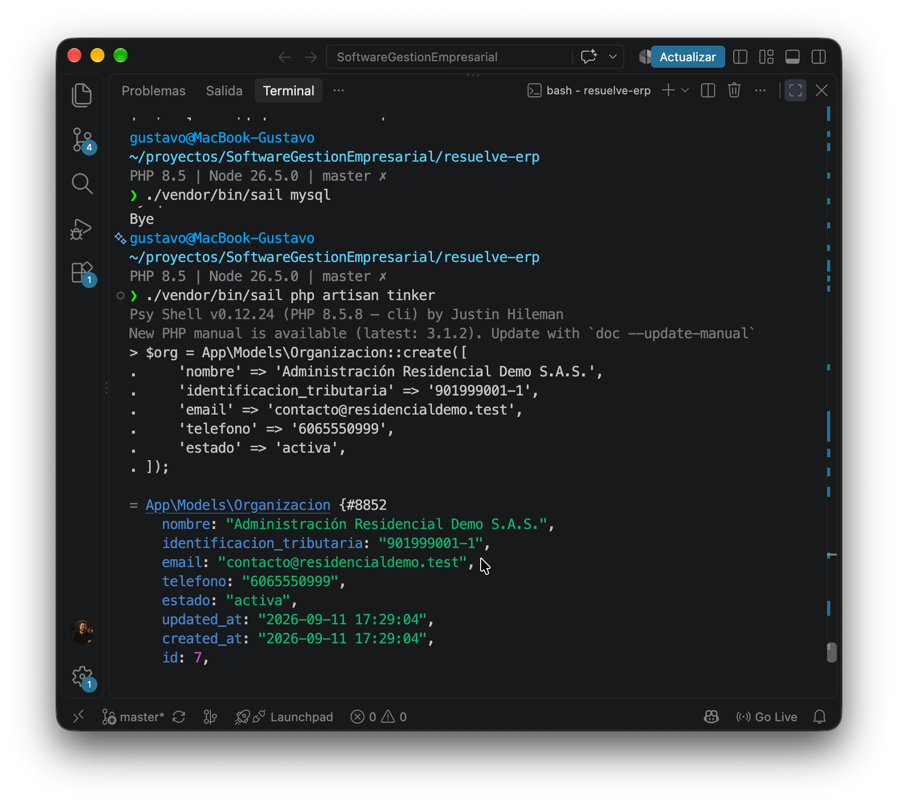

### Relación entre copropiedades y organizaciones

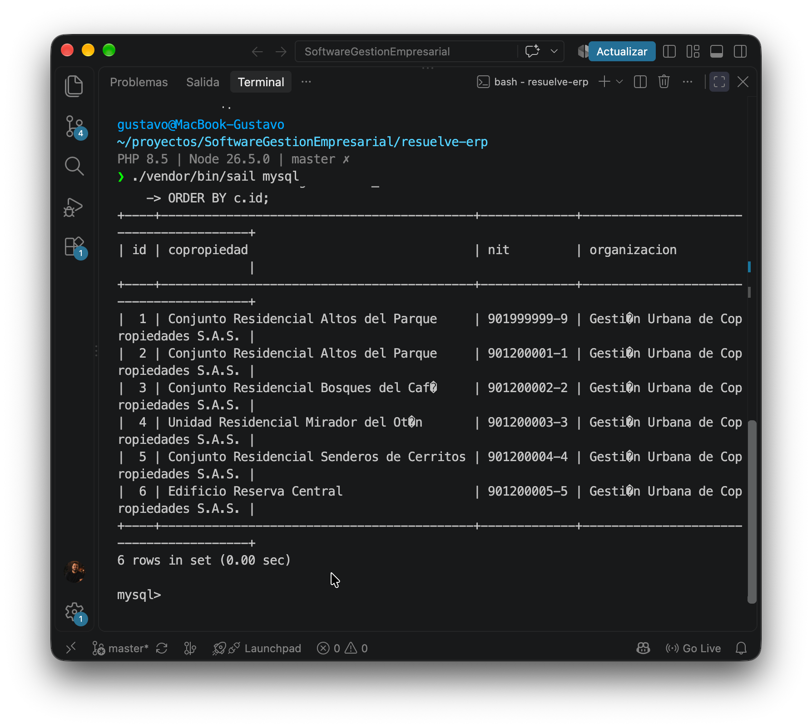

La documentación técnica de la aplicación se encuentra en:

```text
resuelve-erp/README.md
```
