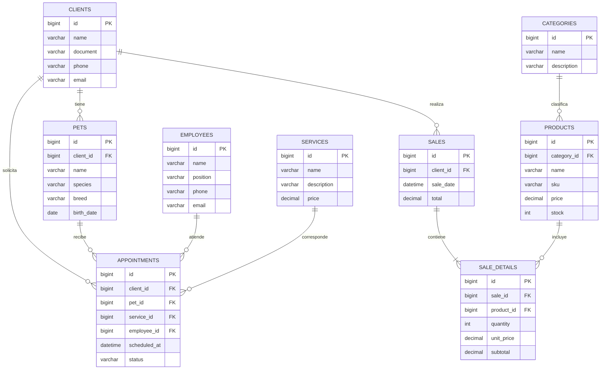

# Análisis de la Veterinaria Huellitas

## 1. Datos Generales

- **Nombre:** Veterinaria Huellitas
- **Giro:** Prestación de servicios veterinarios y comercialización de productos para mascotas.
- **Tamaño:** Pequeña empresa.

Veterinaria Huellitas se dedica a la atención médica veterinaria y a la venta de medicamentos, alimentos, accesorios y juguetes para mascotas. Entre sus servicios se encuentran consultas, vacunación, cirugías, baño y peluquería.

## 2. Procesos Clave

### Ventas

El proceso inicia cuando un cliente solicita un producto para su mascota. Se identifica el producto requerido, se verifica su disponibilidad en inventario, se registra la venta y se actualiza el stock. La información de la transacción debe quedar asociada al cliente cuando corresponda, permitiendo posteriormente consultar las ventas realizadas.

### Servicios

El cliente solicita un servicio para su mascota, como consulta, vacunación, cirugía, baño o peluquería. Se identifican el cliente y la mascota, se agenda una cita según la disponibilidad del personal y se registra el servicio requerido. Una vez prestado el servicio, debe quedar constancia de la atención realizada.

### Compras

Cuando se identifica la necesidad de reabastecer medicamentos, alimentos u otros productos, se selecciona el proveedor correspondiente y se realiza la compra. Al recibir los productos se verifican las cantidades y se actualiza el inventario.

### Inventario

El inventario registra los productos disponibles y sus cantidades. Las compras incrementan las existencias y las ventas las disminuyen. El control del stock permite identificar productos con pocas unidades disponibles y reducir errores o faltantes.

### Clientes

Se registra la información de los dueños de las mascotas y los datos de cada mascota asociada. Un cliente puede tener una o varias mascotas. Esta información permite relacionar posteriormente al dueño y su mascota con citas y servicios.

## 3. Problemas Detectados

Actualmente, Veterinaria Huellitas presenta los siguientes problemas:

1. **Pérdida y dispersión de información:** el uso de cuadernos y hojas de cálculo dificulta mantener centralizados los datos de clientes, mascotas, productos, servicios y ventas.

2. **Errores en el control de inventario:** al realizar el seguimiento de existencias de forma manual, pueden presentarse diferencias entre las cantidades registradas y las cantidades realmente disponibles, además de faltantes de medicamentos o alimentos.

3. **Dificultad para consultar el historial de clientes y mascotas:** la información no se encuentra integrada, lo que dificulta relacionar rápidamente un cliente con sus mascotas, citas y servicios.

4. **Dificultad para tomar decisiones:** al no contar con información consolidada sobre ventas, servicios e inventario, la administración tiene dificultades para obtener indicadores que apoyen la toma de decisiones.

5. **Riesgo de errores en el agendamiento:** el manejo manual de las citas puede generar cruces de horarios, pérdida de información o dificultades para consultar la disponibilidad de los empleados.

## 4. Justificación del ERP

Veterinaria Huellitas necesita un ERP que permita centralizar y relacionar la información de sus principales procesos en un solo sistema.

La implementación del ERP permitiría gestionar clientes y mascotas, controlar las citas y servicios prestados, registrar las ventas, administrar las compras y mantener actualizado el inventario. De esta manera, la información generada por cada proceso estaría disponible para los demás módulos del sistema.

Además, al disponer de información organizada y actualizada, la veterinaria podría reducir errores operativos, mejorar la atención a sus clientes y obtener indicadores sobre ventas, servicios e inventario que faciliten la toma de decisiones.

# Diseño del Modelo de Datos

## 5. Diagrama Entidad-Relación

El siguiente modelo representa las principales entidades necesarias para integrar la gestión de clientes, mascotas, productos, servicios, citas y ventas de Veterinaria Huellitas.

### Relaciones principales

- Un cliente puede tener varias mascotas.
- Un cliente puede solicitar varias citas.
- Una mascota puede tener varias citas.
- Cada cita corresponde a un servicio y es atendida por un empleado.
- Una categoría puede clasificar varios productos.
- Un cliente puede realizar varias ventas.
- Una venta contiene uno o varios detalles de venta.
- Un producto puede aparecer en diferentes detalles de venta.

## 6. Diccionario de Datos

### Tabla: clients

Almacena la información de los propietarios de las mascotas.

| Campo | Tipo | Descripción |
|---|---|---|
| id | BIGINT | Identificador único del cliente. Clave primaria. |
| name | VARCHAR(150) | Nombre completo del cliente. |
| document | VARCHAR(30) | Número de identificación del cliente. |
| phone | VARCHAR(20) | Número telefónico de contacto. |
| email | VARCHAR(255) | Correo electrónico del cliente. |
| created_at | TIMESTAMP | Fecha y hora de creación del registro. |
| updated_at | TIMESTAMP | Fecha y hora de la última actualización. |

### Tabla: pets

Almacena las mascotas registradas y relaciona cada una con su propietario.

| Campo | Tipo | Descripción |
|---|---|---|
| id | BIGINT | Identificador único de la mascota. Clave primaria. |
| client_id | BIGINT | Clave foránea que identifica al propietario de la mascota. |
| name | VARCHAR(100) | Nombre de la mascota. |
| species | VARCHAR(50) | Especie de la mascota, por ejemplo perro o gato. |
| breed | VARCHAR(100) | Raza de la mascota. |
| birth_date | DATE | Fecha de nacimiento de la mascota. |
| created_at | TIMESTAMP | Fecha y hora de creación del registro. |
| updated_at | TIMESTAMP | Fecha y hora de la última actualización. |

### Tabla: products

Almacena los productos comercializados por la veterinaria.

| Campo | Tipo | Descripción |
|---|---|---|
| id | BIGINT | Identificador único del producto. Clave primaria. |
| category_id | BIGINT | Clave foránea que identifica la categoría del producto. |
| name | VARCHAR(150) | Nombre del producto. |
| sku | VARCHAR(50) | Código único utilizado para identificar el producto. |
| price | DECIMAL(10,2) | Precio de venta del producto. |
| stock | INT | Cantidad disponible en inventario. |
| created_at | TIMESTAMP | Fecha y hora de creación del registro. |
| updated_at | TIMESTAMP | Fecha y hora de la última actualización. |

# Propuesta de Solución ERP

## 7. Módulos del Sistema

El ERP para Veterinaria Huellitas estará compuesto por los siguientes módulos:

1. **Clientes y Mascotas:** permite registrar y consultar la información de los propietarios y las mascotas asociadas a cada cliente.

2. **Citas y Servicios Veterinarios:** permite programar citas, asociarlas con una mascota, seleccionar el servicio requerido y asignar al empleado encargado de la atención.

3. **Inventario y Productos:** permite registrar productos, clasificarlos por categorías, controlar las existencias y consultar la disponibilidad de medicamentos, alimentos, accesorios y juguetes.

4. **Ventas:** permite registrar las ventas realizadas a los clientes, los productos vendidos, sus cantidades y el valor total de cada transacción.

5. **Compras y Proveedores:** permite gestionar el abastecimiento de productos y registrar las compras realizadas a los proveedores.

6. **Empleados:** permite administrar la información del personal de la veterinaria, incluyendo veterinarios, auxiliares, recepcionistas y peluqueros.

7. **Reportes e Indicadores:** permite consolidar la información generada por los demás módulos para consultar indicadores de ventas, servicios e inventario que apoyen la toma de decisiones.

## 8. Flujo General del Sistema

Cuando un cliente llega a Veterinaria Huellitas con su mascota, el recepcionista consulta si el cliente ya se encuentra registrado en el sistema. Si es un cliente nuevo, registra sus datos personales y posteriormente registra la mascota, asociándola con su propietario.

A continuación, se agenda la cita seleccionando la mascota, el servicio requerido, la fecha y hora, y el empleado encargado de realizar la atención. El sistema conserva la relación entre el cliente, la mascota, la cita, el servicio y el empleado.

Cuando la mascota es atendida, el empleado consulta la información de la cita y registra la prestación del servicio correspondiente. De esta manera, la veterinaria puede mantener organizada la información de las atenciones realizadas a cada mascota.

Si durante la visita el cliente compra medicamentos, alimentos, accesorios u otros productos, la venta se registra en el módulo de ventas. Cada producto vendido queda asociado al detalle de la venta y su cantidad se descuenta del inventario.

Cuando las existencias de un producto requieren reposición, el módulo de compras permite registrar el abastecimiento realizado a través de los proveedores y actualizar nuevamente las cantidades disponibles en inventario.

Finalmente, la información generada por las citas, servicios, ventas e inventario puede ser consolidada en el módulo de reportes e indicadores para apoyar la toma de decisiones de la veterinaria.

## 9. Indicadores Clave de Desempeño (KPI)

El ERP permitirá obtener indicadores a partir de la información registrada en sus diferentes módulos. Entre los principales KPI se encuentran:

1. **Ventas totales por período:** valor total de las ventas realizadas durante un período determinado. Permite analizar el comportamiento de los ingresos generados por la comercialización de productos.

2. **Número de servicios realizados por período:** cantidad de consultas, vacunaciones, cirugías, baños y servicios de peluquería realizados durante un período determinado. Permite identificar la demanda de los diferentes servicios ofrecidos.

3. **Productos con bajo nivel de inventario:** cantidad de productos cuyas existencias se encuentran por debajo del nivel mínimo establecido. Permite identificar oportunamente la necesidad de reabastecimiento.

4. **Servicios más solicitados:** cantidad de citas realizadas por cada tipo de servicio. Permite identificar cuáles servicios tienen mayor demanda entre los clientes.

## 10. Beneficios de la Implementación del ERP

La implementación del ERP proporcionará a Veterinaria Huellitas los siguientes beneficios:

1. **Centralización de la información:** los datos de clientes, mascotas, citas, servicios, productos, ventas y empleados estarán organizados en un único sistema, reduciendo la dependencia de cuadernos y hojas de cálculo.

2. **Mejor control del inventario:** el registro de entradas y salidas permitirá conocer las existencias disponibles y detectar oportunamente productos que necesitan ser reabastecidos.

3. **Reducción de errores operativos:** la integración de los procesos permitirá disminuir errores relacionados con registros duplicados, pérdida de información, control manual del inventario y programación de citas.

4. **Mejor atención al cliente:** el personal podrá consultar de manera organizada la información del cliente, sus mascotas y las citas asociadas, facilitando la prestación de los servicios.

5. **Apoyo a la toma de decisiones:** los reportes e indicadores permitirán analizar información sobre ventas, servicios e inventario para apoyar la gestión administrativa de la veterinaria.
