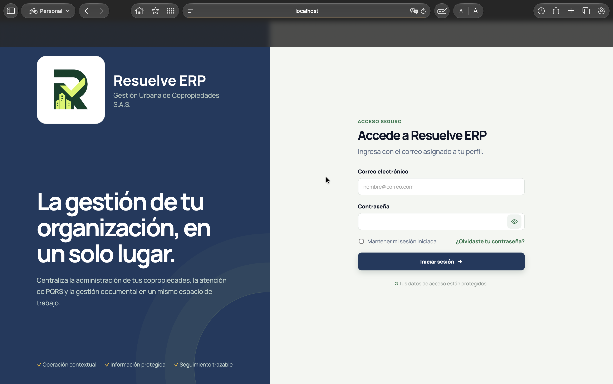
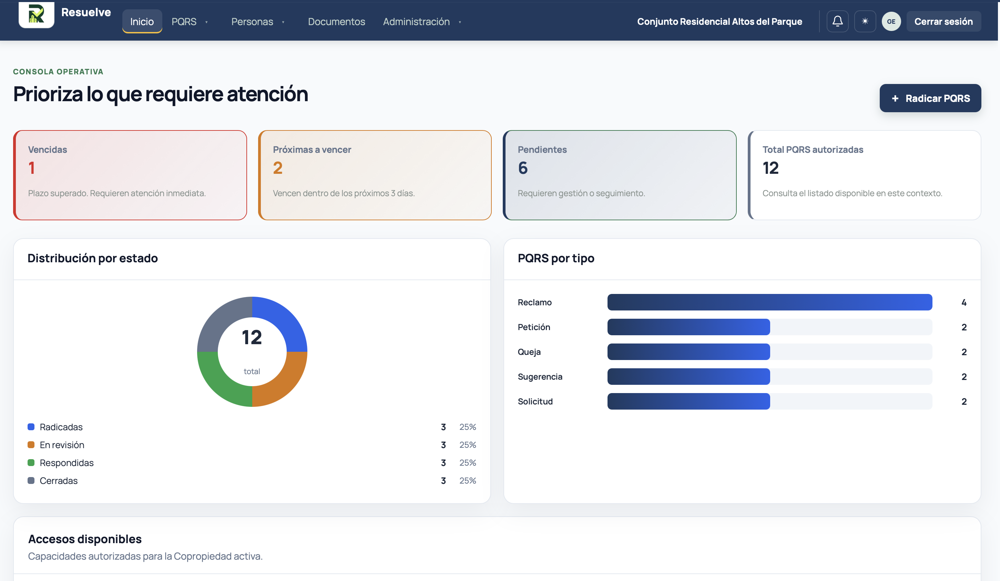
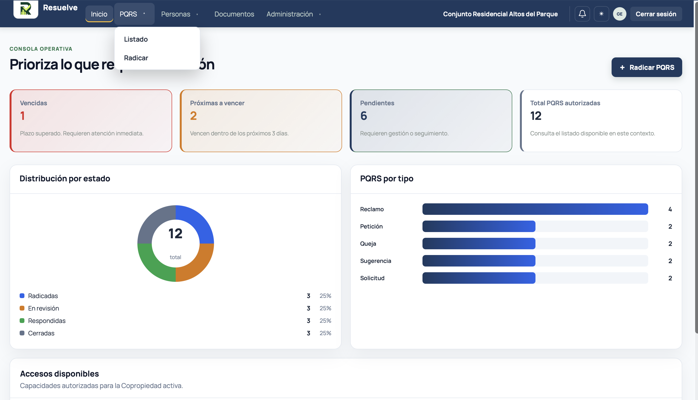
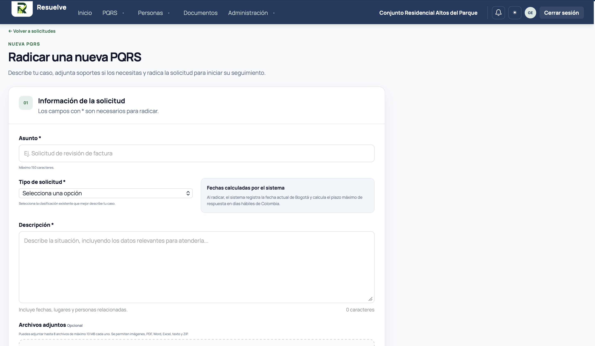
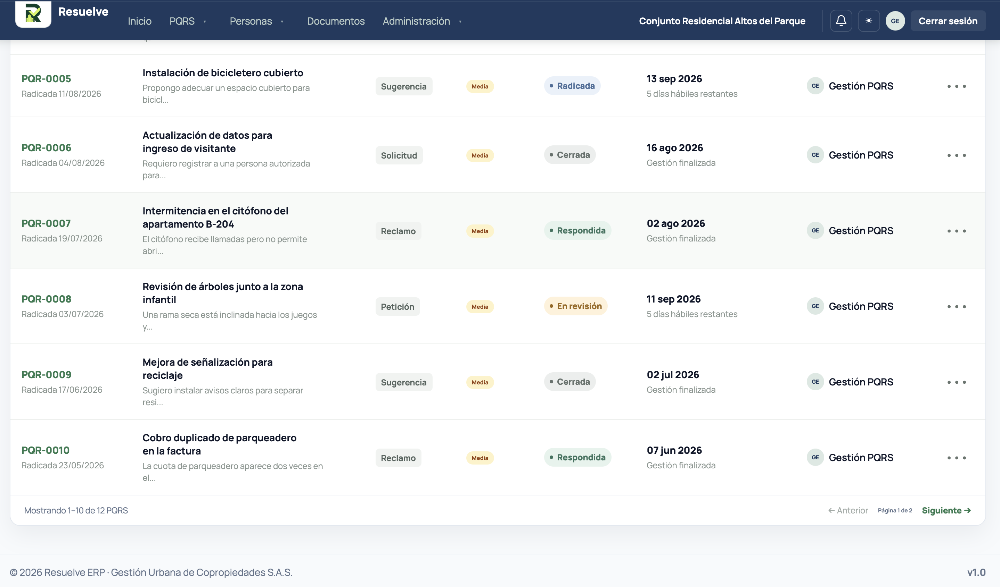
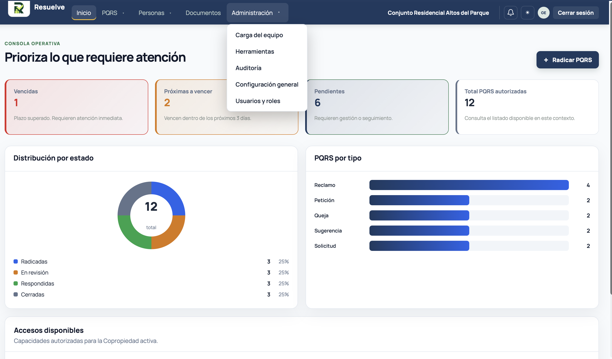

# Resuelve ERP

Sistema de gestión empresarial orientado a la administración de propiedad horizontal. El proyecto centraliza procesos operativos y administrativos de organizaciones y copropiedades, utilizando Laravel, MySQL y Vite.

En su estado actual, el módulo de PQRS constituye uno de los componentes funcionales principales del sistema e integra radicación, seguimiento, asignación, control de vencimientos, respuestas, documentos, notificaciones e indicadores de gestión.

## Funcionalidades

- Radicación y seguimiento de PQRS.
- Roles de administrador, gestor, apoyo, auditor y residente.
- Asignación de responsables, estados, vencimientos y recordatorios.
- Respuestas, adjuntos, comentarios internos, etiquetas y auditoría.
- Panel con estadísticas, filtros e indicadores de cumplimiento.
- Informes profesionales en PDF y Excel.
- Administración de usuarios y configuración de la copropiedad.
- Notificaciones y recuperación de contraseña.
- Diseño adaptable para escritorio y dispositivos móviles.

## Implementación Clase 4 — Autenticación y navegación

Para la Clase 4 se adaptaron los requerimientos de autenticación, control de acceso, navegación y presentación visual a la arquitectura existente de Resuelve ERP.

### Autenticación y control de acceso

El proyecto ya dispone de un sistema de autenticación propio integrado con Laravel, por lo que no fue necesario instalar Laravel Breeze. La aplicación cuenta con:

- Inicio y cierre de sesión.
- Recuperación de contraseña.
- Rutas protegidas para usuarios autenticados.
- Control de acceso mediante roles y permisos.
- Administración controlada de usuarios.
- Redirección posterior al inicio de sesión hacia el panel de Inicio.
- Contexto activo de organización y copropiedad.

El registro público de usuarios no se habilita, debido a que Resuelve ERP es un sistema administrativo para propiedad horizontal. La creación y asignación de usuarios se realiza de forma controlada según la organización, copropiedad, rol y permisos correspondientes.

### Navegación y experiencia de usuario

El módulo autenticado utiliza una barra superior de navegación que centraliza el acceso a Inicio, PQRS, Personas, Documentos y Administración. También presenta la copropiedad activa, notificaciones, selector de tema, información del usuario y cierre de sesión.

El panel de Inicio funciona como punto de entrada después de la autenticación y presenta indicadores y visualizaciones para facilitar la lectura del estado operativo de las PQRS.

La interfaz fue ajustada para mejorar la legibilidad, mantener una jerarquía visual consistente y ofrecer una experiencia adaptable a diferentes tamaños de pantalla.

## Diseño visual y adaptación de la guía

La implementación de la Clase 4 se realizó tomando la guía académica como referencia y adaptándola al estado actual del proyecto. Se conservaron las funcionalidades y la arquitectura previamente desarrolladas cuando estas ya cumplían o superaban los requerimientos planteados.

### Identidad visual

Resuelve ERP utiliza una interfaz de carácter empresarial orientada a facilitar la lectura de información operativa y administrativa.

- Tipografía principal: Manrope, con fuentes del sistema como respaldo.
- Color institucional principal: azul oscuro `#1e3a5f`.
- Uso de colores complementarios para representar estados, prioridades, alertas e indicadores.
- Tarjetas e indicadores visuales para facilitar la interpretación de información.
- Tamaños de texto ajustados para mejorar la legibilidad del módulo autenticado.
- Diseño adaptable para escritorio y dispositivos móviles.
- Soporte para modo claro y modo oscuro.

El encabezado mantiene visible la identidad de Resuelve ERP, la navegación principal y el contexto de la copropiedad activa.

El pie de página del módulo autenticado identifica el sistema, el año actual, la organización activa y la versión de la aplicación.

### Adaptaciones frente a la guía

No se implementó una página pública de inicio adicional, ya que Resuelve ERP está concebido como una aplicación de gestión cuyo acceso principal se realiza mediante autenticación.

Tampoco se habilitó el registro público de usuarios. La gestión de cuentas se mantiene bajo control administrativo para preservar la relación entre usuarios, roles, organizaciones y copropiedades.

Laravel Breeze no fue incorporado porque el proyecto ya cuenta con autenticación, recuperación de contraseña, protección de rutas, control de acceso y gestión de usuarios implementados.

Como formulario funcional se utiliza la radicación de PQRS, integrada al dominio real de la aplicación, en lugar de incorporar un formulario demostrativo independiente.

Estas decisiones permiten cumplir los objetivos funcionales de la actividad académica manteniendo la coherencia arquitectónica y funcional del proyecto.

## Evidencias visuales — Clase 4

Las siguientes capturas documentan la implementación y adaptación de los requerimientos trabajados durante la Clase 4.

### Inicio de sesión

Pantalla de autenticación personalizada de Resuelve ERP.



### Panel de Inicio

Panel principal mostrado al usuario después de autenticarse, con indicadores y visualizaciones de la operación.



### Navegación principal

Barra de navegación del módulo autenticado con acceso a los diferentes componentes del sistema y contexto de la copropiedad activa.



### Radicación de PQRS

Formulario funcional para registrar una nueva PQRS dentro de la copropiedad activa.



### Listado de PQRS

Bandeja operativa para consultar y gestionar las PQRS registradas.



### Administración

Interfaz correspondiente a las funcionalidades administrativas del sistema.



## Requisitos

- PHP 8.3 o superior.
- Composer.
- Node.js y npm.
- MySQL 8.4 o una base compatible.
- Docker Desktop, opcionalmente si se desea utilizar Laravel Sail.

## Instalación local

Instalar las dependencias de PHP:

```bash
composer install
```

Instalar las dependencias de frontend:

```bash
npm install
```

Crear el archivo de configuración local:

```bash
cp .env.example .env
```

Generar la clave de la aplicación:

```bash
php artisan key:generate
```

Configurar en el archivo `.env` las credenciales correspondientes a la base de datos.

Ejecutar las migraciones y cargar los datos iniciales:

```bash
php artisan migrate --seed
```

Compilar los recursos del frontend:

```bash
npm run build
```

Iniciar el servidor de desarrollo:

```bash
php artisan serve
```

Por defecto, la aplicación estará disponible en:

```text
http://127.0.0.1:8000
```

Para trabajar con Vite en modo desarrollo puede ejecutarse, en una segunda terminal:

```bash
npm run dev
```

## Ejecución opcional con Laravel Sail

El proyecto también dispone de configuración para ejecutarse mediante Docker y Laravel Sail.

Iniciar los contenedores:

```bash
./vendor/bin/sail up -d
```

Ejecutar las migraciones y cargar los datos iniciales:

```bash
./vendor/bin/sail artisan migrate --seed
```

Instalar las dependencias de frontend:

```bash
./vendor/bin/sail npm install
```

Compilar los recursos:

```bash
./vendor/bin/sail npm run build
```

En la configuración actual de Sail se utilizan los siguientes puertos:

- Aplicación: `8083`.
- Vite: `5175`.
- MySQL: `3308`.

Cuando se utilice Sail con esta configuración, la aplicación estará disponible en:

```text
http://localhost:8083
```

## Pruebas

Para ejecutar la suite de pruebas utilizando PHP local:

```bash
php artisan test
```

Si el proyecto se está ejecutando mediante Laravel Sail:

```bash
./vendor/bin/sail artisan test
```

## Seguridad

- No publiques el archivo `.env`.
- Cambia las credenciales de demostración antes de exponer la aplicación.
- Usa `APP_ENV=production` y `APP_DEBUG=false` en producción.
- Configura almacenamiento persistente para logos y adjuntos.
- Realiza copias de seguridad periódicas de la base de datos y archivos.

## Licencia

Proyecto académico y de demostración. Antes de utilizarlo con información real, revisa las obligaciones de protección de datos aplicables.
