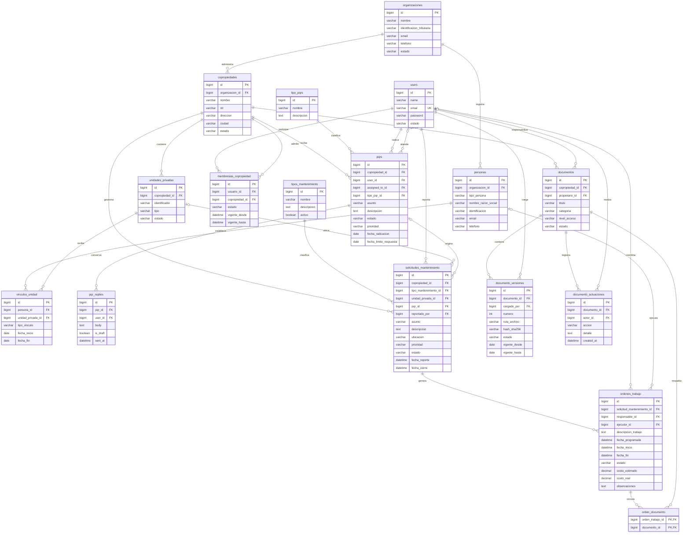

# MER Resuelve ERP

El modelo representa las entidades y relaciones de la plataforma para la administración de copropiedades. El avance de implementación se documenta por separado.

## Lectura del diagrama

- **PK:** clave primaria.
- **FK:** clave foránea.
- **UK:** valor único.
- **Uno a muchos:** un registro puede relacionarse con varios registros de otra entidad.
- Las relaciones opcionales permiten que no exista un registro asociado.

## Reglas principales

- Una organización administra varias copropiedades.
- Los usuarios participan en copropiedades mediante membresías.
- Las personas se vinculan con unidades privadas como propietarios, residentes u otros tipos de vínculo.
- Una PQRS puede originar varias solicitudes de mantenimiento; también pueden registrarse solicitudes sin una PQRS previa.
- Una solicitud de mantenimiento puede generar varias órdenes de trabajo.
- El responsable de una orden coordina la actividad; el ejecutor puede ser una persona natural o jurídica.
- Las solicitudes pueden corresponder a una unidad privada o a una zona común identificada mediante su ubicación.
- Los documentos conservan versiones e historial de actuaciones.
- Una orden puede tener varios documentos de soporte y un documento puede respaldar varias órdenes.
- Los vínculos entre registros deben respetar la organización y copropiedad correspondientes.

## Alcance del modelo

Se muestran las entidades y atributos principales para explicar los procesos del negocio. Se omiten tablas auxiliares de permisos, notificaciones, auditoría técnica y otros detalles de infraestructura.